# photoAlbum_Camposano

## Program: Bachelor of Science in Information Technology

## Activity Title: LAB ACTIVITY: PHOTO ALBUM WEB APPLICATION (LARAVEL FRAMEWORK)

## Name: Rosemarie Jane A. Camposano

## Site Description

This is a simple photo album web application built using Laravel. It showcases the diverse attractions of Cebu Province, including its natural landscapes, cultural heritage, local delicacies, festivals, and museums. Users can browse through images organized into different categories, providing a visual tour of what Cebu has to offer.

The project includes:

-   **Home Page:** Displays the heading “My Photo Album” and links to pages 1–5 namely: Nature, Heritage, Delicacies, Festivals, and Museums.
-   **Pages:** Each page shows 20 images, with a description/identification for each image.
-   **Total Images:** 100 images, divided into 5 pages.

## Description of Pages and Categories

### **Page 1: Nature Escapes: Cebu Edition**

-   This page focuses on showcasing Cebu's natural wonders. From swimming with whale sharks in Oslob to wandering through the colorful blooms of Sirao Garden, it highlights the island’s diverse natural beauty.

Categories:

1. **Oslob Whale Shark Watching**

    - Description: Swim beside gentle giants in the clear waters of Oslob—an awe-inspiring encounter with nature’s grace.
    - Images: Includes a set of images that showcase the experience of interacting with whale sharks.

2. **Tumalog Falls**

    - Description: Veiled in mist and silence, Tumalog Falls cascades like silk through the forest air.
    - Images: A collection of breathtaking photos of the falls, including serene landscapes and water flowing gently.

3. **Cebu Safari and Adventure Park**

    - Description: From roaring lions to lush trails, Cebu Safari offers a wild escape into nature’s heart.
    - Images: Features images of animals like tigers, zebras, and more, showcasing the wild beauty of Cebu Safari.

4. **Sirao Garden**
    - Description: Dubbed Cebu’s Little Amsterdam, Sirao blooms with color, charm, and mountain breeze.
    - Images: Offers views of the vibrant flowers in full bloom and the peaceful, cool atmosphere of the garden.

**Total Images of Page:** 20
**Images per Section:** 5

### **Page 2: Cebu: Threads of Time**

-   This page takes you through some of Cebu’s most significant historical sites, where faith, culture, and resilience are intertwined. Key landmarks are showcased, each offering a unique perspective on Cebu’s heritage.

Categories:

1. **Magellan’s Cross**

    - Description: Planted on April 14, 1521, this cross marks the site where Ferdinand Magellan introduced Christianity to the locals of Cebu.
    - Images: Visuals include the historic cross under a dome adorned with murals.

2. **Mactan Shrine**

    - Description: A monument to Lapu-Lapu, the Filipino hero who resisted Magellan’s colonization efforts and marked the site of his famous victory.
    - Images: Photos capture the statue of Lapu-Lapu and the surrounding historic shrine.

3. **Cebu Heritage Monument**

    - Description: A tribute to Cebu’s historical and cultural milestones, this monument stands as a testament to the island's enduring identity.
    - Images: Images include the intricate sculptures representing Cebu's colorful past.

4. **Basilica del Santo Niño**

    - Description: One of the oldest Catholic churches in Cebu, it stands as a testament to Cebu's deep Christian roots and spiritual history.
    - Images: Visuals of the Basilica, the oldest Catholic church in Cebu, capturing its religious significance.

5. **Cebu Metropolitan Cathedral**

    - Description: The ecclesiastical seat of the Archdiocese of Cebu, this cathedral is a beautiful example of Spanish colonial architecture.
    - Images: Photos highlight the grandeur and grace of Cebu’s religious heart.

6. **Fort San Pedro**

    - Description: Built in 1565, Fort San Pedro is the Philippines' oldest triangular bastion and a symbol of Cebu’s colonial past.
    - Images: Photos show the fort surrounded by greenery, offering a peaceful glimpse into history.

7. **Taoist Temple**

    - Description: Perched in Cebu's hills, this temple built by the Chinese Filipino community in 1972 offers vibrant and serene views.
    - Images: Pagodas and dragons guard this tranquil temple, shown in the photos.

8. **Chapel of San Pedro Calungsod**

    - Description: Built in 2012, this modern chapel honors Pedro Calungsod, the second Filipino saint and martyr.
    - Images: Images highlight the chapel's unique architecture and spiritual depth.

9. **Yap-Sandiego Ancestral House**

    - Description: A 17th-century house blending Spanish and Chinese architecture, showcasing Cebu’s rich heritage.
    - Images: Visuals of the house’s interior and the preserved relics that reflect Filipino ancestry.

10. **Museo de Sugbo**
    - Description: Cebu's provincial museum housed in a former Spanish-era jail, showcasing Cebu's history from pre-colonial to modern times.
    - Images: Photos capture the museum’s exhibits, turning a once jailhouse into a landmark of history.

**Total Images of Page:** 20
**Images per Section:** 2

### **Page 3: Delicacies of Cebu: Culture in Every Bite**

-   This page celebrates the vibrant and diverse culinary culture of Cebu, showcasing the island's rich food heritage through various categories. From "Cebuano classics" that have been beloved for generations to "native sweets and desserts" that satisfy every sweet tooth, and from "heritage treats" passed down through the ages to the lively "street foods" that capture Cebu’s street culture, each dish reflects the heart and soul of Cebu.

1. **Cebuano Classics**

    - Description: Traditional Cebuano favorites that have stood the test of time, often featured in local gatherings and celebrations.
        - Delicacies:
            - **Lechon sa Talisay**: Famous roasted pig with crispy skin and tender meat, a festive centerpiece of Cebu.
            - **Ngohiong**: Crunchy spring roll filled with spiced heart of palm, a beloved street food snack.
            - **Chorizo de Cebu**: Sweet and savory local sausage, often grilled and paired with rice.
            - **Balbacua**: Slow-cooked beef stew with gelatinous cuts, rich in flavor.
            - **Siomai sa Tisa**: Steamed pork dumplings from Tisa, known for their garlicky, savory taste.

2. **Native Sweets & Desserts**

    - Description: Sweets and desserts that showcase Cebu’s local flavors, perfect for satisfying your sweet tooth.

        - Delicacies:
            - **Budbud**: Sticky rice delicacy wrapped in banana leaves, often paired with hot chocolate.
            - **Masi**: Glutinous rice balls filled with sweet peanut paste, soft and chewy.
            - **Puto & Sikwate**: Steamed rice cakes served with traditional hot chocolate made from tablea cacao.
            - **Bibingka**: Soft rice cake baked with coconut milk, a warm treat often enjoyed during festivals.
            - **Tagaktak**: Crispy, lace-like rice fritters, a unique Visayan snack.

3. **Heritage Treats**

    - Description: Timeless delicacies passed down through generations, often rooted in Cebu’s rich cultural history.

        - Delicacies:
            - **Masareal**: Sweet rectangular bars made of ground peanuts and sugar, a treat from Mandaue.
            - **Otap**: Flaky, oval-shaped puff pastry sprinkled with sugar, light and crunchy.
            - **Salvaro**: Thin, crisp coconut biscuits with subtle sweetness.
            - **Ampao**: Crunchy puffed rice squares sweetened with syrup.
            - **Rosquillos**: Ring-shaped butter cookies, famously linked to Liloan, Cebu.

4. **Street Foods**

    - Description: Quick and flavorful snacks, served right from the bustling streets of Cebu.

        - Delicacies:
            - **Ginabot**: Deep-fried pork intestines, crunchy outside and chewy inside, a popular street snack.
            - **Tuslob-Buwa**: Savory bubbling sauce made from pig brain, soy sauce, and spices, enjoyed with **puso** (rice wrapped in banana leaves).
            - **Lansiao**: Exotic stew made from bull testicles, often served with a rich broth.
            - **Larang**: Spicy, sour stew often cooked with reef fish or eel, commonly served at roadside eateries.
            - **Carcar’s Chicharon**: Crispy pork rinds from Carcar, Cebu, famous for their crunch and seasoning.

**Total Images of Page:** 20
**Images per Section:** 5

### **Page 4: Festivals of Cebu: Culture in Motion**

-   This page highlights the vibrant festivals of Cebu, where tradition and culture come to life through colorful dances, music, and celebrations. From the grand "Sinulog Festival" to the eco-conscious "Siloy Festival", each event showcases Cebu’s rich heritage, religious devotion, and community spirit. This guide takes you on a journey through Cebu’s most iconic festivals, offering an immersive experience of its lively celebrations.

1. **Sinulog Festival**

    - Description: Cebu City’s grand January celebration honoring the Santo Niño, featuring vibrant street dancing, colorful costumes, and deep religious devotion.
    - Images: Visuals include dancers in traditional attire and vibrant street processions.

2. **Siloy Festival**

    - Description: Alcoy’s August fest that promotes the conservation of the endangered siloy bird while honoring St. Rose of Lima with eco-themed dances and cultural shows.
    - Images: Photos of the festival’s dancers and nature-inspired performances.

3. **Kadaugan sa Mactan Festival**

    - Description: Lapu-Lapu City’s April 27 reenactment of the 1521 Battle of Mactan, commemorating Lapu-Lapu’s victory over Magellan and celebrating local heroism.
    - Images: Dramatic depictions of the reenactment, showcasing the historical significance of the battle.

4. **Kabkaban Festival**

    - Description: Carcar City’s November fiesta for St. Catherine of Alexandria, blending ritual dances, heritage displays, and traditions tied to the kabkaban fern.
    - Images: Vibrant images of dancers and traditional performances honoring the kabkaban fern.

5. **Halad Inasal Festival**

    - Description: Talisay City’s October 15 thanksgiving feast celebrating the town's famous lechon, with street dancing and offerings to St. Therese of Avila.
    - Images: Celebratory visuals of lechon and street dances expressing gratitude.

6. **Utanon Festival**

    - Description: Dalaguete’s February 10th harvest festival honoring San Guillermo de Aquitania and celebrating its pride as Cebu’s "Vegetable Basket."
    - Images: Photos capturing the festive atmosphere of Dalaguete’s agricultural pride.

7. **Silhig Festival**

    - Description: Mandaue City’s tribute to local broom-making, showcasing the artistry and craftsmanship of broom-makers through vibrant street dances and cultural displays.
    - Images: Dancers performing in vibrant costumes with broom props.

8. **Katubhan Festival**

    - Description: Medellin’s April 27th celebration of sugarcane harvests, honoring the Sto. Niño and celebrating the town’s enduring sugar industry heritage.
    - Images: Festivities honoring the sugar industry and community spirit.

9. **Pintos Festival**

    - Description: Bogo City’s celebration of its corn-based delicacy, pintos, marked by colorful parades and thanksgiving for agricultural abundance.
    - Images: Colorful visuals of parades and local dishes made from pintos.

10. **Panagtagbo Festival**
    - Description: Mandaue City’s May fiesta honoring St. Joseph the Worker, featuring street dancing and community gatherings that unite barangays.
    - Images: A vibrant display of community unity through dance and local celebrations.

**Total Images of Page:** 20
**Images per Section:** 2

### **Page 5: Museums Beyond Heritage: Cebu’s Creative Side**

-   This page showcases Cebu's rich and vibrant art scene through its diverse museums, each offering a unique perspective on creativity and culture. From interactive 3D art at the "Cebu Happy World Museum", to the expressive works at the "Paulina Constancia Museum of Naïve Art", and modern collections at "Qube Gallery", to the architectural grandeur of the "Temple of Leah", each museum represents a different facet of Cebu’s artistic journey.

1. **Cebu Happy World Museum**

-   Description: A 3D interactive art museum in Cordova, Cebu, featuring over 70–85 optical illusion paintings created by Korean artists. The museum offers a fun and immersive experience where visitors can step into the artwork and become part of the story.
-   Images: Highlights optical illusion art where visitors become part of the story and interact with vibrant paintings.

2. **Paulina Constancia Museum of Naïve Art**

-   Description: Located at West Gorordo Hotel, this museum showcases paintings, textiles, and naïve art pieces that emphasize simplicity, honesty, and storytelling free from academic art rules. It celebrates art that captures raw and sincere expressions.
-   Images:Features whimsical and childlike art that celebrates simplicity and the beauty of everyday life.

3. **Qube Gallery**

-   Description: A leading contemporary art gallery in Cebu City, known for curating exhibitions of Filipino and international artists. It’s a space for modern artistic expressions and is central to the evolving art scene in Cebu.
-   Images: Displays modern artworks that reflect evolving identities and showcase daring new voices.

4. **Temple of Leah**

-   Description: Built in 2012 by Teodorico Soriano Adarna as a tribute to his wife Leah, this grand structure is often referred to as the “Taj Mahal of Cebu.” It blends architecture with art, making it a prominent landmark in Cebu.
-   Images: Showcases Roman-inspired sculptures, Greek columns, and the grandeur of the tribute to enduring love.

**Total Images of Page:** 20
**Images per Section:** 5

## **Features:**

    -   Laravel routing
    -   Blade templating
    -   Pagination / manual page navigation
    -   Custom CSS styling
    -   Proper folder structure
    -   Images properly displayed without missing links
    
## 🖥 Navigation

- The header **“Soul of the South”** acts as a **home button** on every page, allowing users to return to the Home Page easily.  
- Left and right navigation buttons let users smoothly browse through images on each page.  
- Clicking an image opens it in a larger view, **looping only within its category**, keeping browsing focused and organized.

## 📸 Project Screenshots

Here’s a preview of the **Photo Album Web Application**:

    <em>Home Page – Displays navigation links to all five categories.</em>
     
    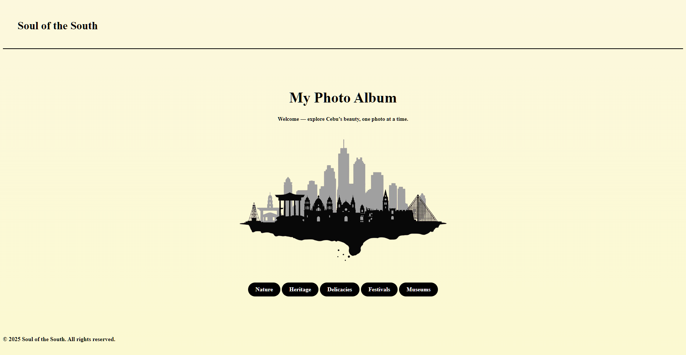
  

    <em>Nature Page – Showcasing Cebu’s natural attractions.</em>
     
    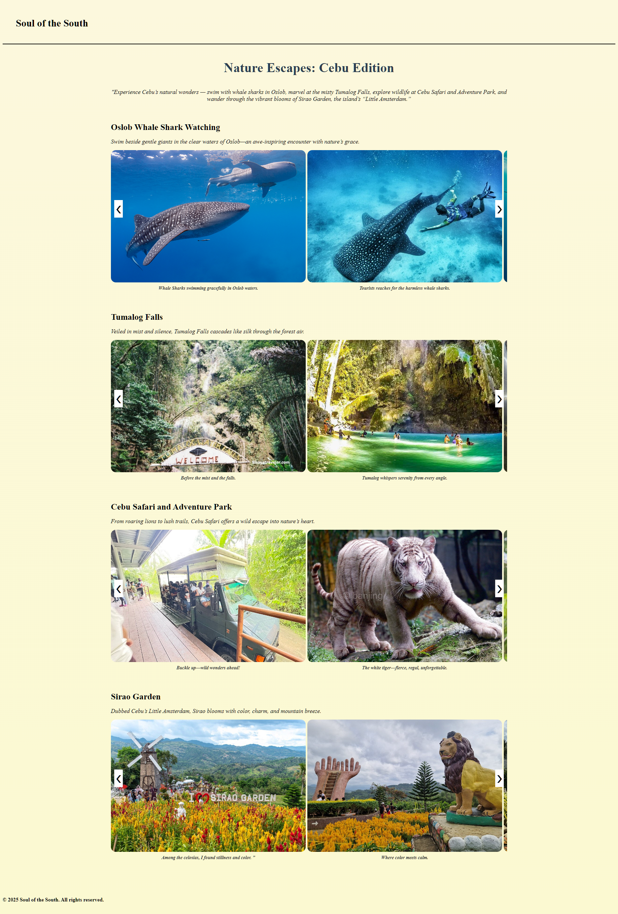
    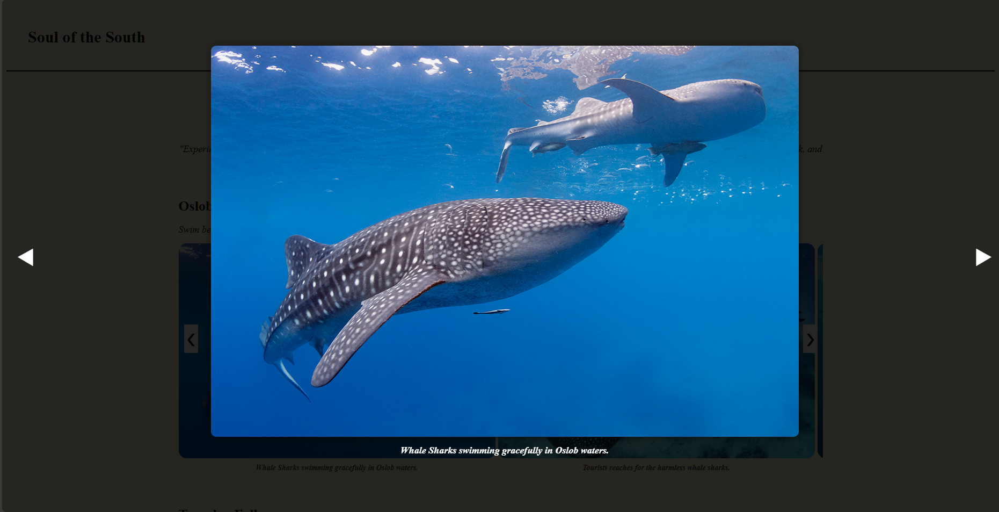
   
 

    <em>Heritage Page – Showcasing Cebu’s rich heritage.</em>
     
    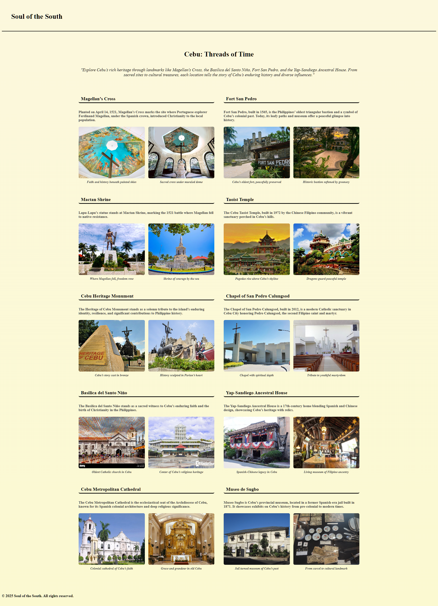
    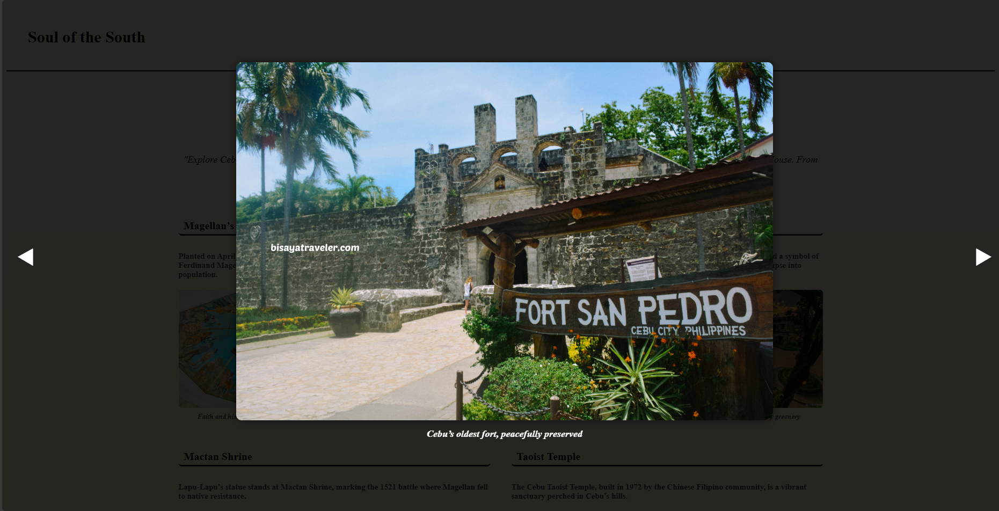
   

    <em>Delicacies Page – Featuring Cebu’s rich food culture.</em>
     
    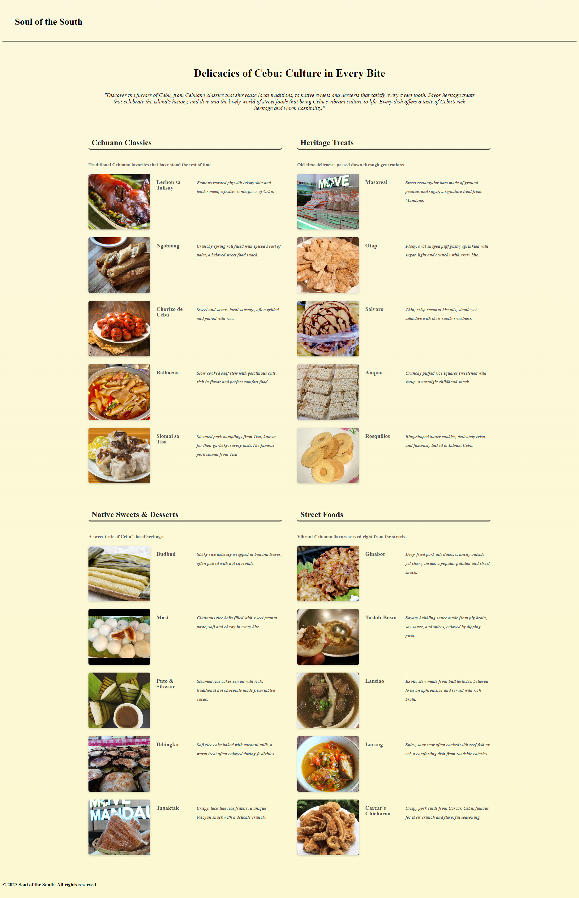
    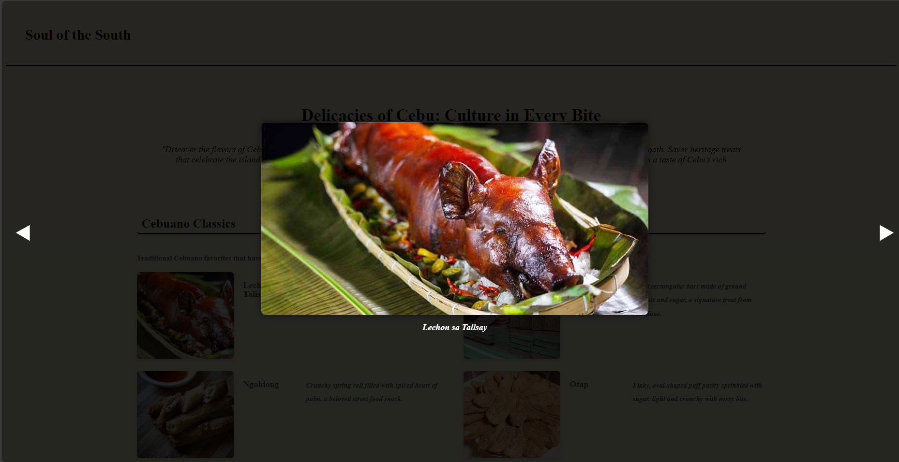
   
  

    <em>Festivals Page – Celebrating Cebu’s colorful events and traditions.</em>
     
    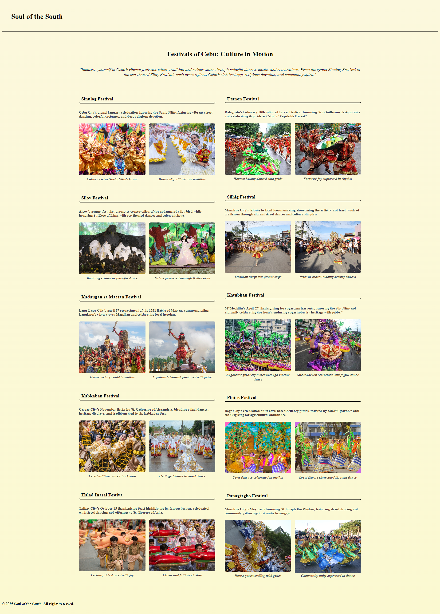
    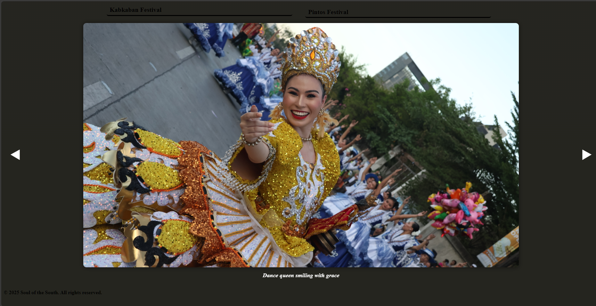
 
  

    <em>Museums Page – Exploring Cebu’s artistic and historical museums.</em>
     
    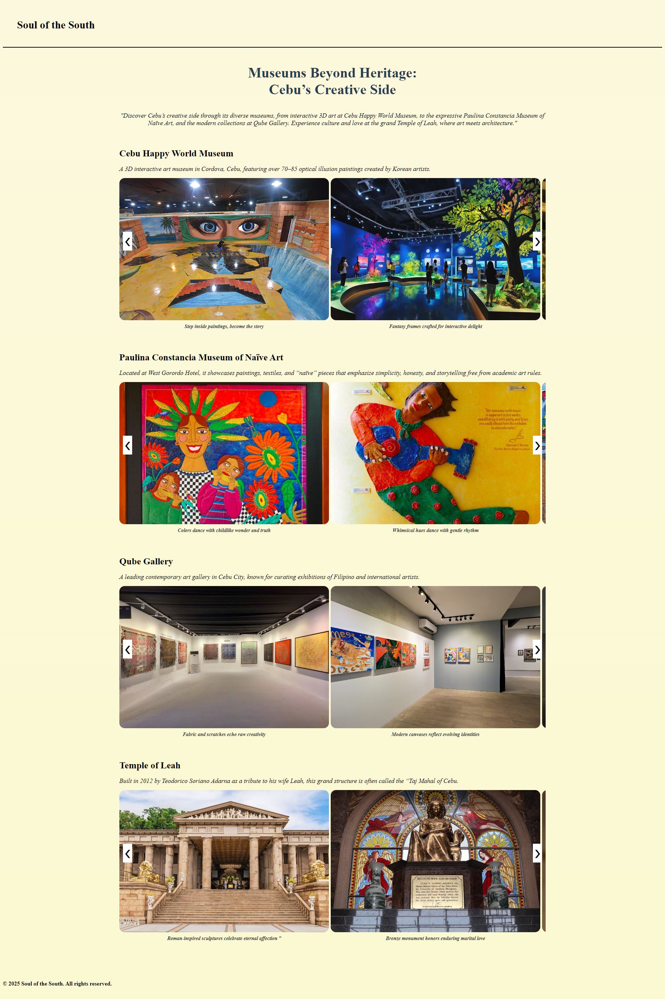
    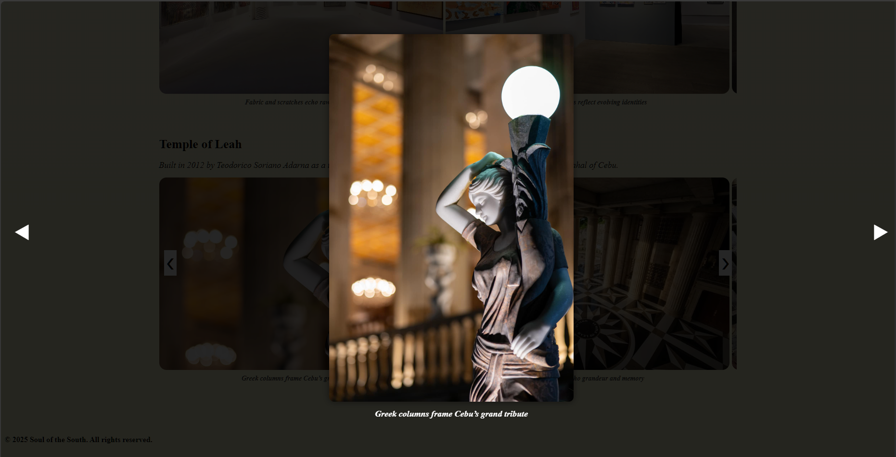

  

